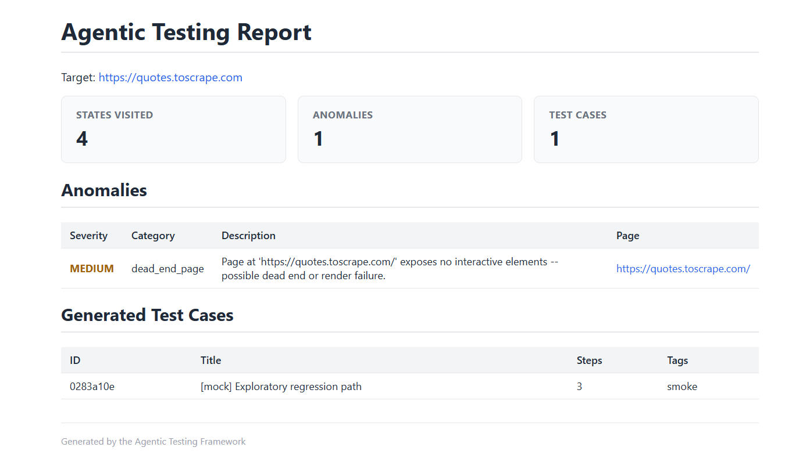

# Agentic Testing Framework

Autonomous web testing agent built on the MAPE-K (Monitor–Analyze–Plan–Execute–Knowledge) 
self-adaptive architecture. Point it at a URL it explores the application, detects 
anomalies, generates replayable regression test cases, and writes a self-contained HTML report.

Built as a research project exploring agentic system design patterns for software testing 
automation, motivated by work on resilient agentic systems (AsianPLoP 2026) and 
LLM-based software engineering.

## Quick Start

```bash
# Install
pip install -r requirements.txt
python -m playwright install chromium

# Run with mock LLM  no API key needed, full MAPE-K loop still runs
python main.py --url https://quotes.toscrape.com --provider mock --max-steps 15

# Run with real LLM for smarter exploration
export ANTHROPIC_API_KEY="sk-..."
python main.py --url https://your-app.com --provider anthropic --max-steps 40
```

> **Note:** the agent checkpoints after every step. Delete `run_output/` between 
> runs if you want exploration to start fresh rather than resume.

## Sample Output



*4 states visited, 1 anomaly detected, 1 regression test case generated 
against `https://quotes.toscrape.com` using the mock provider.*

## Architecture

The framework maps the five MAPE-K stages onto distinct, independently 
testable components the key design decision being that "how to interact 
with a browser" and "how to decide what to test next" are completely 
separate concerns.

```
┌─────────────────────────────────────────────────────┐
│                    Supervisor                       │
│  ┌──────────┐  ┌──────────┐  ┌──────────┐          │
│  │ Monitor  │→ │ Analyzer │→ │ Planner  │          │
│  │(Browser) │  │(Heuristic│  │ (LLM)    │          │
│  │          │  │  + LLM)  │  │          │          │
│  └──────────┘  └──────────┘  └────┬─────┘          │
│       ↑                          ↓                 │
│  ┌──────────┐              ┌──────────┐            │
│  │ Executor │← ← ← ← ← ← │  Action  │            │
│  │(Browser) │              │          │            │
│  └──────────┘              └──────────┘            │
│                 ┌──────────────┐                   │
│                 │ KnowledgeBase│ (visited states,   │
│                 │   (JSON)     │  anomalies, tests) │
│                 └──────────────┘                   │
└─────────────────────────────────────────────────────┘
```

### Components

| Component | Implementation | Purpose |
|-----------|---------------|---------|
| Monitor | `PlaywrightDriver` | DOM snapshot: hash, elements, console errors |
| Analyzer | `HeuristicLLMAnalyzer` | Novelty detection + anomaly oracle |
| Planner | `LLMPlanner` | Action selection + test case synthesis |
| Executor | `PlaywrightDriver` | Browser action execution with retries |
| Knowledge | `JsonKnowledgeBase` | Visited states, anomaly log, test store |

### Resilience Patterns

Each pattern addresses a specific failure mode in LLM-in-the-loop systems:

| Pattern | Failure mode it handles |
|---------|------------------------|
| `retry_with_backoff` | Transient failures  flaky selectors, network blips |
| `CircuitBreaker` | Persistent failures stops retrying a permanently broken action |
| `CheckpointManager` | Crash recovery  resume from last good state |
| `Bulkhead` | Fault isolation — one bad session can't abort the whole run |

## Known Limitations

- Mock LLM uses rule-based action selection; real LLM provider achieves 
  significantly deeper and more varied exploration
- Element extraction capped at 25 elements per page to keep LLM context manageable
- Currently supports Chromium only via Playwright

## Project Structure

```
agentic-testing-framework/
├── main.py                          # CLI entry point
├── src/
│   ├── models.py                    # Core dataclasses (PageState, Action, TestCase, etc.)
│   ├── patterns/
│   │   ├── mape_k.py                # Abstract MAPE-K interfaces
│   │   └── resilience.py            # Retry, CircuitBreaker, Checkpoint, Bulkhead
│   ├── browser/
│   │   └── playwright_driver.py     # Playwright wrapper (Monitor + Executor)
│   ├── llm/
│   │   └── client.py                # LLM providers (Anthropic, OpenAI, Mock)
│   ├── knowledge/
│   │   └── state_memory.py          # JSON-backed KnowledgeBase
│   ├── agent/
│   │   ├── analyzer.py              # Heuristic + LLM anomaly detection
│   │   ├── planner.py               # LLM-guided action selection + test synthesis
│   │   ├── executor.py              # TestCase replay with retries
│   │   └── supervisor.py            # MAPE-K loop orchestrator
│   └── reporting/
│       └── report_generator.py      # Self-contained HTML report
├── tests/
│   ├── test_resilience_patterns.py  # Unit tests for resilience primitives
│   └── fixtures/                    # Static HTML pages for local testing
├── examples/
│   └── run_demo.py                  # Quick demo script
└── docs/
    └── ARCHITECTURE.md              # Detailed design rationale
```

## Running Tests

```bash
pip install -r requirements-dev.txt
pytest tests/ -v          # unit tests for resilience patterns, no browser needed
```

## CLI Options

```
python main.py --help
  --url URL              Target URL to explore
  --provider {anthropic,openai,mock}
  --model MODEL          Model name (default: claude-sonnet-4-6)
  --max-steps N          Max exploration steps (default: 30)
  --max-depth N          Max depth before backtracking (default: 6)
  --output-dir DIR       Output directory (default: ./run_output)
  --no-headless          Show the browser window
  --verbose              Debug logging
```

## License

MIT — see [LICENSE](LICENSE).
